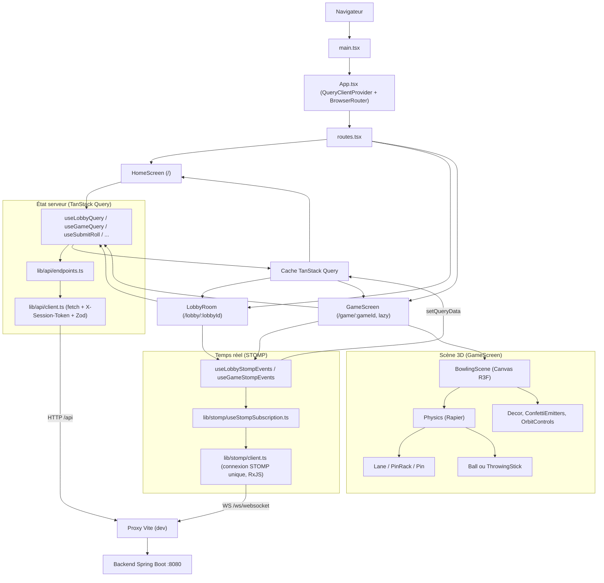
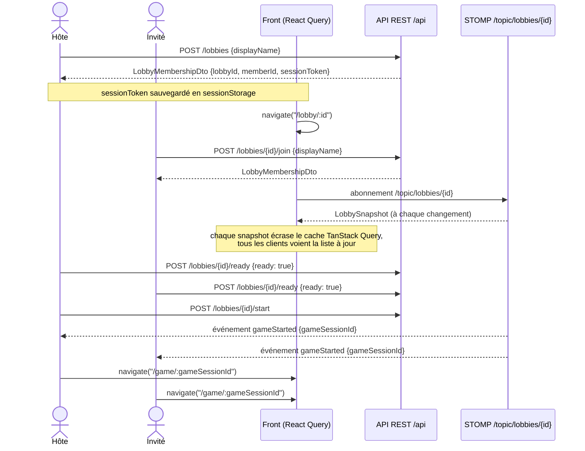
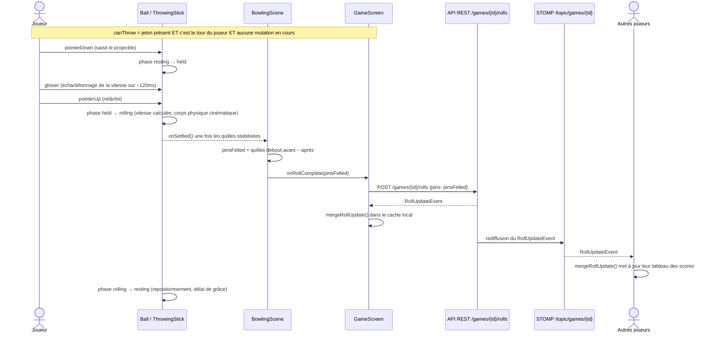
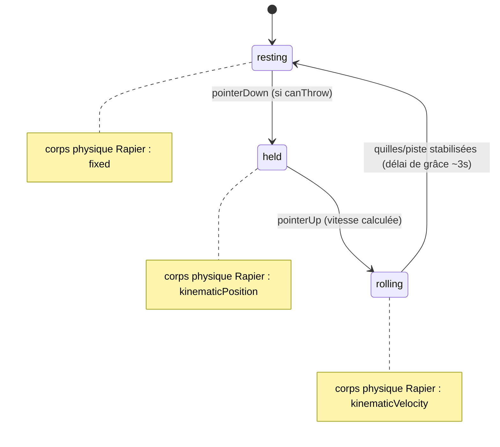

# Telemis Bowl


> Des fouilles archéologiques récentes ont mis au jour les règles d'un jeu ancien, étrangement proche du bowling. Reconstituez-le en temps réel avec vos amis.

| Mode boule | Mode bâton (en vol) |
|---|---|
|  |  |

Front-end du jeu **Telemis Bowl** : un bowling 3D multijoueur en temps réel (thème « fouilles archéologiques / plage tropicale »), construit en React 19 + Vite + Three.js (via React Three Fiber) et Rapier pour la physique. Le front consomme un **backend Spring Boot séparé** (non inclus dans ce dépôt) via REST et WebSocket STOMP.

## Sommaire

- [Le jeu](#le-jeu)
- [Fonctionnalités](#fonctionnalités)
- [Pile technique](#pile-technique)
- [Architecture](#architecture)
- [Arborescence du projet](#arborescence-du-projet)
- [Démarrage rapide](#démarrage-rapide)
- [Flux applicatif : du lobby à la partie](#flux-applicatif--du-lobby-à-la-partie)
- [Flux applicatif : un lancer](#flux-applicatif--un-lancer)
- [Scène 3D et assets](#scène-3d-et-assets)
- [Tests et qualité](#tests-et-qualité)
- [Design system](#design-system)
- [Déploiement et limites connues](#déploiement-et-limites-connues)
- [Licence](#licence)

## Le jeu

- **15 quilles** (pas 10), disposées en triangle sur 5 rangées (`PIN_ROW_SIZES = [1, 2, 3, 4, 5]`).
- Un **strike** correspond à faire tomber les 15 quilles au premier lancer de la frame.
- Le score de la partie est calculé **côté backend** : le front n'envoie que le nombre de quilles tombées à chaque lancer et affiche l'état renvoyé par le serveur.
- Deux façons de jouer : lancer une **boule** (roulée sur la piste) ou un **bâton** (lancé en cloche, trajectoire balistique).
- Trois tailles de piste (`small` / `medium` / `large`) ; le mode bâton impose la petite piste.

## Fonctionnalités

- **Lobby partageable** : identifiant de lobby copiable en un clic, statut « prêt » par joueur, démarrage réservé à l'hôte (le solo est volontairement autorisé).
- **Temps réel** via WebSocket STOMP : la liste des joueurs, les lancers et le score courant sont poussés instantanément à tous les participants.
- **Scène 3D physique** : piste, râtelier de 15 quilles, décor (plage, grotte, palmiers), ciel dynamique, confettis animés pour les strikes/spares/fins de partie.
- **Gestuelle de lancer** : glisser-relâcher à la souris/au doigt, vitesse calculée à partir de l'historique du pointeur.
- **Robustesse d'affichage** : repli explicite si WebGL est indisponible, et récupération automatique après perte du contexte graphique (GPU driver crash, onglet mis en veille, etc.).
- **Accessibilité** : respect de `prefers-reduced-motion` (désactivation des animations non essentielles), annonces `aria-live` pour les changements de tour et de statut.
- **Isolation par onglet** : chaque session de jeu est stockée dans `sessionStorage`, pas `localStorage`, pour permettre d'ouvrir plusieurs joueurs dans des onglets différents du même navigateur.

## Pile technique

| Rôle | Outils |
|---|---|
| UI | React 19, React Router 7 |
| État serveur / cache | TanStack Query 5 |
| Temps réel | `@stomp/stompjs` 7, RxJS 7 |
| Rendu 3D | Three.js, `@react-three/fiber` 9, `@react-three/drei` 10 |
| Physique | `@react-three/rapier` 2 (`@dimforge/rapier3d-compat`) |
| Validation | Zod 4 |
| Style | Tailwind CSS 4, tokens CSS maison |
| Animation UI | Framer Motion 13, `vegas` (diaporama du lobby) |
| Build / test / lint | Vite 8, Vitest 5, oxlint, oxfmt |
| Pipeline 3D (assets) | `@gltf-transform/*`, `obj2gltf`, `sharp` |

## Architecture



## Arborescence du projet

```
src/
├── app/                 # Point d'entrée, routing (routes.tsx)
├── features/
│   ├── lobby/            # Écran d'accueil + salle d'attente
│   ├── game/              # Partie en cours
│   │   └── scene/         # Composants React Three Fiber (piste, quilles, projectiles)
│   └── preview/           # ⚠️ temporaire, généré pour des captures d'écran — non destiné à rester
├── components/ui/        # Composants UI de base (bouton, carte, input, label)
├── lib/
│   ├── api/               # Client HTTP + endpoints REST + schémas Zod
│   ├── stomp/              # Connexion et abonnements WebSocket STOMP
│   ├── session/            # Persistance en sessionStorage (jetons, choix du joueur)
│   ├── throw/              # Logique de lancer partagée (bâton)
│   └── confetti/           # Émetteurs de particules de célébration
├── styles/                # Tokens CSS, typographie
└── assets/                # Images statiques (logo, slideshow du lobby)
public/
├── models/                # Modèles 3D .glb consommés par la scène
└── fonts/                 # Polices auto-hébergées
tests/game/                # Tests unitaires (Vitest) sur la logique pure
```

Règle de découpage observée dans le code : la **logique pure** (calcul de scores, physique du lancer, tailles de piste) est extraite dans des fichiers `.ts` testables indépendamment des composants React/R3F (`frameDisplay.ts`, `gameCache.ts`, `scene/ballRollLogic.ts`, `scene/pinSettleLogic.ts`, `scene/stickThrowLogic.ts`, `lib/throw/stickThrowMath.ts`).

## Démarrage rapide

### Prérequis

- Node.js récent (aucune version minimale n'est déclarée dans le projet — à valider selon votre environnement).
- Un **backend Spring Boot** de Telemis Bowl lancé sur `http://localhost:8080` (dépôt séparé). Sans lui, toutes les requêtes échoueront (`SERVER_UNREACHABLE`).

### Installation et lancement

```bash
npm install
npm run dev
```

Aucune variable d'environnement n'est nécessaire : `vite.config.ts` proxifie déjà `/api` et `/ws` vers `http://localhost:8080`, donc le front n'appelle que son propre origin (pas de configuration CORS à gérer).


### Scripts npm

| Script | Description |
|---|---|
| `npm run dev` | Serveur de développement Vite |
| `npm run build` | `tsc -b && vite build` — build de production dans `dist/` |
| `npm run preview` | Sert le build de production localement |
| `npm run test` | Exécute les tests Vitest |
| `npm run lint` | Lint via oxlint |

Le projet référence aussi des scripts de génération/optimisation de modèles 3D :

```bash
npm run generate:models   # generate-pin / generate-lane / generate-logo / generate-stick
npm run convert:decor     # convert-decor.mjs (obj2gltf)
npm run optimize:decor    # optimize-decor.mjs (@gltf-transform + sharp)
```

> ⚠️ **Les fichiers `scripts/models/*.mjs` correspondants sont actuellement absents de ce dépôt.** Ces commandes npm échoueront tant que le répertoire `scripts/` n'est pas restauré ou recréé. Les modèles `.glb` déjà présents dans `public/models/` restent utilisables sans ces scripts.

## Flux applicatif : du lobby à la partie



## Flux applicatif : un lancer



### Machine à états du projectile



Le WebSocket STOMP **ne rejoue pas l'historique manqué** pendant une coupure réseau : à la reconnexion, les abonnés doivent resynchroniser leur état via un nouvel appel REST plutôt que de se fier uniquement aux prochains messages.

## Scène 3D et assets

Les dimensions physiques de la piste, de la gouttière et des quilles sont centralisées dans `src/features/game/scene/sceneConstants.ts` (hauteur de quille 0,381 m, masse 0,1 kg répartie sur deux capsules de collision, etc.), et déclinées par taille de piste dans `laneSizes.ts` :

| Taille | Demi-longueur piste | Modèle `.glb` |
|---|---|---|
| `small` | 3 m | `bowling_lane_small.glb` |
| `medium` | 4,5 m | `bowling_lane_medium.glb` |
| `large` | 6 m | `bowling_lane_large.glb` |

Les modèles 3D versionnés se trouvent dans `public/models/` (piste, quille, boule, bâton, décor : plage, grotte, palmiers, rochers...). Le pipeline de génération/optimisation prévu par les scripts npm (voir [Démarrage rapide](#démarrage-rapide)) part des sources `.obj`/Blender dans `public/models/obj_src/` pour produire ces `.glb`, mais les scripts correspondants ne sont actuellement pas présents dans ce dépôt.

## Tests et qualité

```bash
npm run test
```

Les tests (Vitest) couvrent la **logique pure** sous `tests/game/` : calcul des symboles de frame (X/spare), logique de roulement de la boule, stabilisation des quilles, physique du lancer de bâton, tailles de piste, choix du projectile. Il n'y a pas aujourd'hui de tests de composants React ni de suite end-to-end automatisée.

```bash
npm run lint
```

Lint via oxlint (configuration par défaut, aucun fichier de config dédié au dépôt). `oxfmt` est installé comme dépendance de dev mais aucun script `format` n'est défini dans `package.json`.

## Design system

Les tokens visuels (`src/styles/tokens.css`) définissent une palette « relique sauvage » (pierre, sable, terracotta, or) et redéfinissent explicitement les couleurs par défaut de Tailwind pour empêcher leur usage accidentel (ex. `bg-slate-900`). Trois familles de polices sont auto-hébergées dans `public/fonts/`.

## Déploiement et limites connues

- `npm run build` produit un build statique dans `dist/`.
- En production, le front appelle toujours **son propre origin** pour `/api` et `/ws` (pas de variable d'environnement pour cibler un backend différent) : un reverse proxy doit exposer le frontend statique et le backend Spring Boot sous la **même origine**.
- `src/features/preview/` est un module explicitement marqué comme temporaire dans son propre code (généré pour produire des captures d'écran) et ne doit pas être considéré comme une fonctionnalité du produit.

## Licence

Propriété de télémis tout droit réservé
