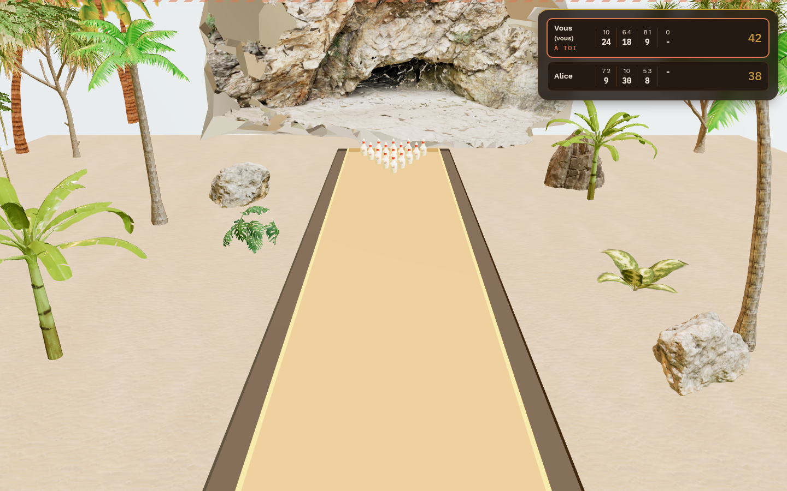
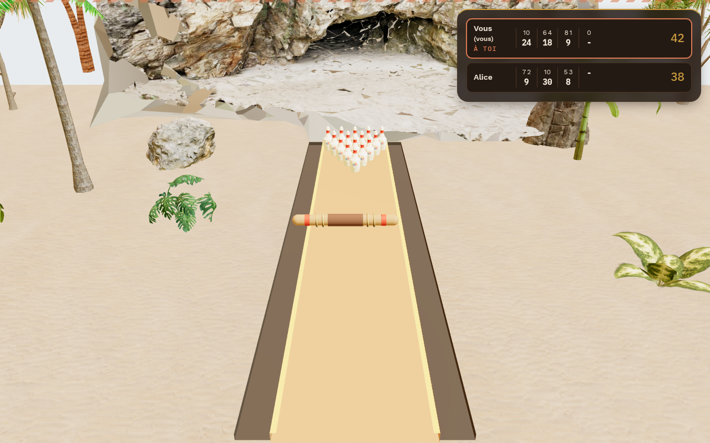
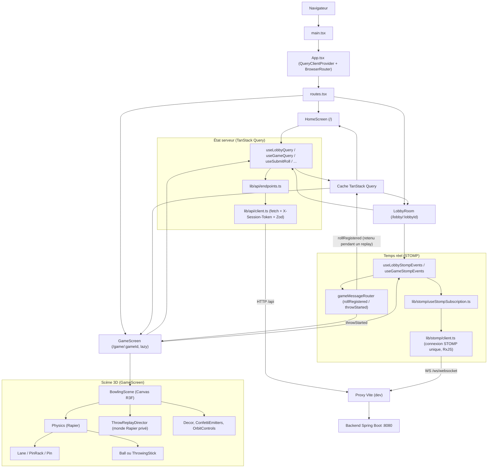
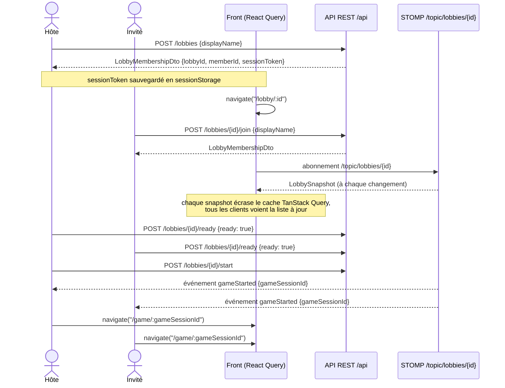
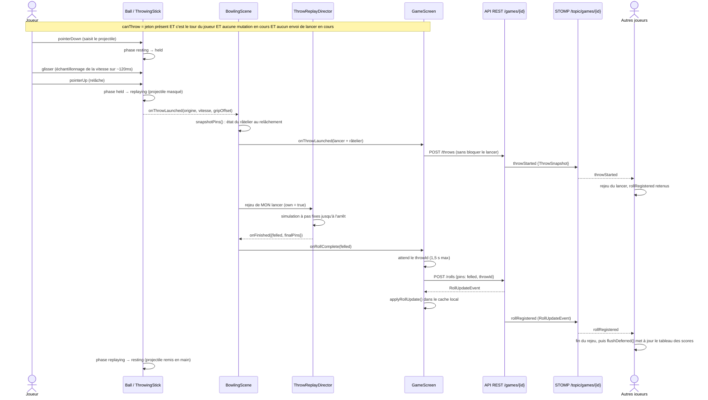
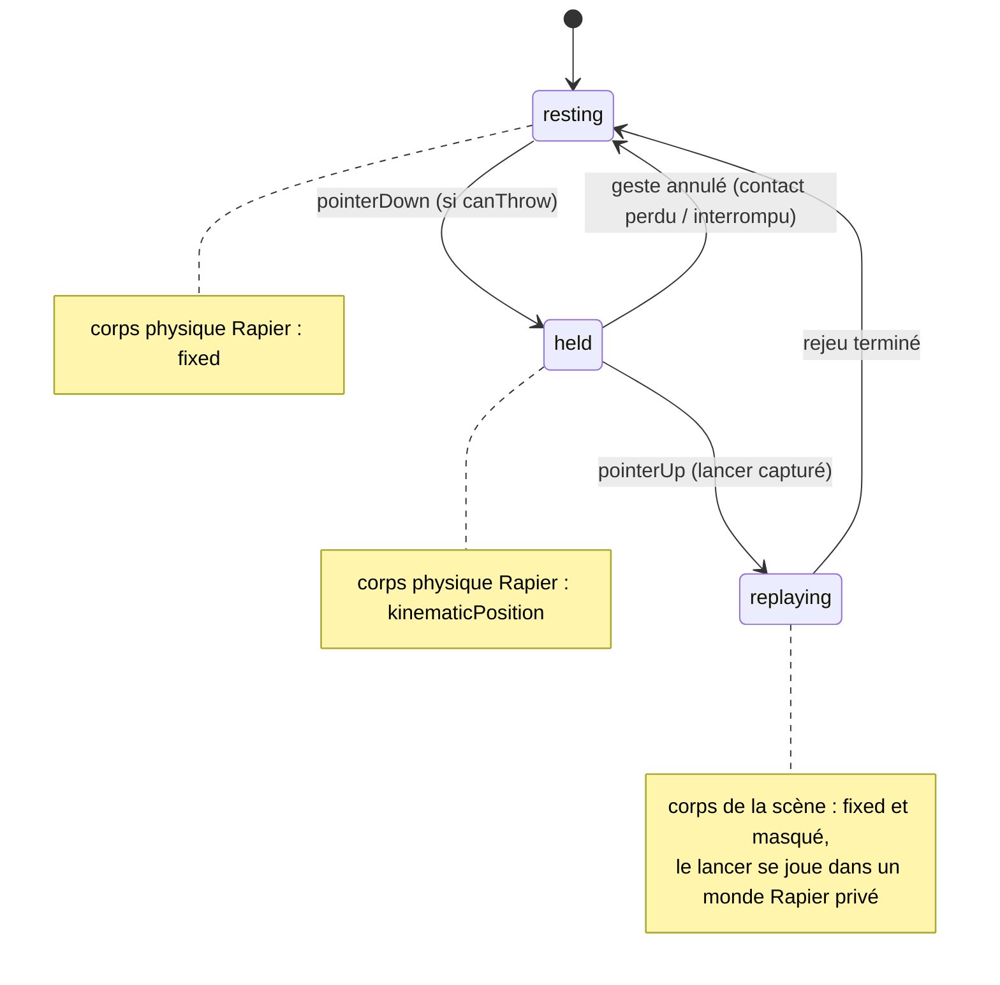

# Sandbatlle Online


> Des fouilles archéologiques récentes ont mis au jour les règles d'un jeu ancien, étrangement proche du bowling. Reconstituez-le en temps réel avec vos amis.

| Mode boule | Mode bâton (en vol) |
|---|---|
|  |  |

Front-end du jeu **Sandbatlle Online** : un bowling 3D multijoueur en temps réel (thème « fouilles archéologiques / plage tropicale »), construit en React 19 + Vite + Three.js (via React Three Fiber) et Rapier pour la physique. Le front consomme un **backend Spring Boot séparé** (non inclus dans ce dépôt) via REST et WebSocket STOMP.

## Sommaire

- [Le jeu](#le-jeu)
- [Fonctionnalités](#fonctionnalités)
- [Pile technique](#pile-technique)
- [Architecture](#architecture)
- [Arborescence du projet](#arborescence-du-projet)
- [Démarrage rapide](#démarrage-rapide)
- [Flux applicatif : du lobby à la partie](#flux-applicatif--du-lobby-à-la-partie)
- [Flux applicatif : un lancer](#flux-applicatif--un-lancer)
- [Replay des lancers](#replay-des-lancers)
- [Scène 3D et assets](#scène-3d-et-assets)
- [Tests et qualité](#tests-et-qualité)
- [Design system](#design-system)
- [Déploiement et limites connues](#déploiement-et-limites-connues)
- [Licence](#licence)

## Le jeu

- **15 quilles** (pas 10), disposées en triangle sur 5 rangées (`PIN_ROW_SIZES = [1, 2, 3, 4, 5]`).
- Un **strike** correspond à faire tomber les 15 quilles au premier lancer de la frame.
- Le score de la partie est calculé **côté backend** : le front envoie le nombre de quilles tombées à chaque lancer (mesuré par la simulation physique locale du lancer, voir [Replay des lancers](#replay-des-lancers)) et affiche l'état renvoyé par le serveur.
- Deux façons de jouer : lancer une **boule** (roulée sur la piste) ou un **bâton** (lancé en cloche, trajectoire balistique).
- Trois tailles de piste (`small` / `medium` / `large`).
- **L'hôte choisit l'objet de lancer et la taille de piste pour toute la partie** ; ces réglages sont envoyés au démarrage (`POST /lobbies/{id}/start`) et reviennent dans le snapshot de la partie. Le lobby ne propose la taille de piste qu'avec la boule ; le bâton impose la petite piste (`laneSizeFor`), quelle que soit la taille mémorisée dans l'onglet de l'hôte, qui est conservée si l'hôte repasse à la boule.

## Fonctionnalités

- **Lobby partageable** : tiroir d'invitation repliable (`InviteDrawer`, fermeture par Échap ou clic extérieur) avec l'identifiant de lobby copiable en un clic, statut « prêt » par joueur, démarrage réservé à l'hôte (le solo est volontairement autorisé).
- **Réglages de partie par l'hôte** : objet de lancer (boule ou bâton) et taille de piste, appliqués à tous les joueurs. Les autres joueurs voient un message leur indiquant que l'hôte choisit.
- **Temps réel** via WebSocket STOMP : la liste des joueurs, les lancers et le score courant sont poussés instantanément à tous les participants.
- **Replay des lancers** : quand un joueur relâche son projectile, les autres joueurs voient ce lancer se rejouer dans leur propre scène, et le score n'apparaît qu'une fois le lancer vu. Détails dans [Replay des lancers](#replay-des-lancers).
- **Scène 3D physique** : piste, râtelier de 15 quilles, décor (plage, grotte, palmiers, sable), ciel dynamique, confettis animés pour les strikes/spares/fins de partie.
- **Gestuelle de lancer** : glisser-relâcher à la souris/au doigt, vitesse calculée à partir de l'historique du pointeur. Le bâton se saisit en un point de sa longueur (`gripOffset`), qui fait partie des variables du lancer.
- **Physique du bâton** : modèle aérodynamique (`stickAerodynamics.ts`), propriétés de masse (`stickMassProperties.ts`), impact dans le sable (`stickSandImpact.ts`) et résistance au roulement (`rollingResistance.ts`).
- **Robustesse d'affichage** : repli explicite si WebGL est indisponible, et récupération automatique après perte du contexte graphique (GPU driver crash, onglet mis en veille, etc.).
- **Accessibilité** : respect de `prefers-reduced-motion` (désactivation des animations non essentielles), annonces `aria-live` pour les changements de tour et de statut.
- **Isolation par onglet** : chaque session de jeu est stockée dans `sessionStorage`, pas `localStorage`, pour permettre d'ouvrir plusieurs joueurs dans des onglets différents du même navigateur.

## Pile technique

| Rôle | Outils |
|---|---|
| UI | React 19, React Router 7 |
| État serveur / cache | TanStack Query 5 |
| Temps réel | `@stomp/stompjs` 7, RxJS 7 |
| Rendu 3D | Three.js, `@react-three/fiber` 9, `@react-three/drei` 10 |
| Physique | `@react-three/rapier` 2 (`@dimforge/rapier3d-compat`, version **épinglée** à `0.19.2` : le replay repose sur la même simulation chez tous les clients) |
| Validation | Zod 4 |
| Style | Tailwind CSS 4, tokens CSS maison |
| Animation UI | Framer Motion 13, `vegas` (diaporama du lobby) |
| Build / test / lint | Vite 8, Vitest 5 (+ `@vitest/coverage-v8`), oxlint, oxfmt |
| Pipeline 3D (assets) | `@gltf-transform/*`, `obj2gltf`, `sharp` |

## Architecture



## Arborescence du projet

```
src/
├── app/                 # Point d'entrée, routing (routes.tsx)
├── features/
│   ├── lobby/            # Écran d'accueil + salle d'attente (réglages de l'hôte, tiroir d'invitation)
│   ├── game/              # Partie en cours
│   │   ├── replay/        # Rejeu déterministe des lancers (monde Rapier privé, score, charge utile)
│   │   └── scene/         # Composants React Three Fiber (piste, quilles, projectiles) + simulation du lancer
├── components/ui/        # Composants UI de base (bouton, carte, input, label)
├── lib/
│   ├── api/               # Client HTTP + endpoints REST + schémas Zod
│   ├── stomp/              # Connexion et abonnements WebSocket STOMP
│   ├── session/            # Persistance en sessionStorage (jetons, choix du joueur)
│   ├── throw/              # Logique de lancer partagée (bâton)
│   └── confetti/           # Émetteurs de particules de célébration
├── styles/                # Tokens CSS, typographie
└── assets/                # Images statiques (logo, slideshow du lobby)
public/
├── models/                # Modèles 3D .glb consommés par la scène
└── fonts/                 # Polices auto-hébergées
tests/game/                # Tests Vitest : logique pure + simulations Rapier (*.rapier.test.ts)
```

Règle de découpage observée dans le code : la **logique pure** (calcul de scores, physique du lancer, tailles de piste, replay) est extraite dans des fichiers `.ts` testables indépendamment des composants React/R3F (`frameDisplay.ts`, `gameCache.ts`, `gameMessageRouter.ts`, `scene/ballRollLogic.ts`, `scene/ballThrowSim.ts`, `scene/stickThrowSim.ts`, `scene/pinSettleLogic.ts`, `scene/rackLogic.ts`, `scene/stickThrowLogic.ts`, `replay/replayOutcome.ts`, `replay/throwPayload.ts`, `replay/pendingThrow.ts`, `lib/throw/stickThrowMath.ts`).

## Démarrage rapide

### Prérequis

- Node.js récent (aucune version minimale n'est déclarée dans le projet — à valider selon votre environnement).
- Un **backend Spring Boot** de Sandbatlle Online lancé sur `http://localhost:8080` (dépôt séparé). Sans lui, toutes les requêtes échoueront (`SERVER_UNREACHABLE`).

### Installation et lancement

```bash
npm install
npm run dev
```

Aucune variable d'environnement n'est nécessaire : `vite.config.ts` proxifie déjà `/api` et `/ws` vers `http://localhost:8080`, donc le front n'appelle que son propre origin (pas de configuration CORS à gérer).


### Scripts npm

| Script | Description |
|---|---|
| `npm run dev` | Serveur de développement Vite |
| `npm run build` | `tsc -b && vite build` — build de production dans `dist/` |
| `npm run preview` | Sert le build de production localement |
| `npm run test` | Exécute les tests Vitest |
| `npm run test:coverage` | Tests avec couverture v8 (rapport texte) sur `src/features/game/**/*.ts` et `src/lib/api/**/*.ts` |
| `npm run lint` | Lint via oxlint |

Le projet référence aussi des scripts de génération/optimisation de modèles 3D :

```bash
npm run generate:models   # generate-pin / generate-lane / generate-logo / generate-stick
npm run convert:decor     # convert-decor.mjs (obj2gltf)
npm run optimize:decor    # optimize-decor.mjs (@gltf-transform + sharp)
```

> ⚠️ **Les fichiers `scripts/models/*.mjs` correspondants sont actuellement absents de ce dépôt.** Ces commandes npm échoueront tant que le répertoire `scripts/` n'est pas restauré ou recréé. Les modèles `.glb` déjà présents dans `public/models/` restent utilisables sans ces scripts.

## Flux applicatif : du lobby à la partie



## Flux applicatif : un lancer



### Machine à états du projectile



Le projectile de la scène ne roule plus lui-même : au relâchement il est remis à sa position de repos et masqué, et c'est `ThrowReplayDirector` qui joue le lancer (voir ci-dessous).

Le WebSocket STOMP **ne rejoue pas l'historique manqué** pendant une coupure réseau : à la reconnexion, les abonnés doivent resynchroniser leur état via un nouvel appel REST plutôt que de se fier uniquement aux prochains messages. Un `throwStarted` manqué pendant une coupure n'est donc pas rattrapé : ce joueur ne verra pas le replay de ce lancer.

## Replay des lancers

Un lancer n'est plus « roulé » en direct dans la scène : il est **décrit** au relâchement, puis **joué** de la même façon chez tous les clients, y compris chez celui qui l'a lancé.

**Ce qui est envoyé** (`POST /games/{id}/throws`, schéma `ThrowLaunchPayload`) : le type de projectile, la taille de piste, l'origine, la vitesse, le `gripOffset` (bâton) et l'état du râtelier (pose et présence en jeu de chacune des 15 quilles). Le serveur relaie ce lancer aux autres joueurs par l'événement STOMP `throwStarted`.

**Comment il est joué** (`src/features/game/replay/`) :

- `replayWorld.ts` construit un **monde Rapier privé** à partir de zéro, avec les constantes du jeu, les variables du lancer et l'état du râtelier. Rien de la physique vivante de la scène n'intervient.
- `throwReplay.ts` fait avancer ce monde **à pas fixes** (`PHYSICS_TIMESTEP` = 1/60 s) jusqu'à l'arrêt du projectile et des quilles. Le résultat dépend du nombre de pas, pas de l'horloge : deux clients obtiennent le même lancer.
- `ThrowReplayDirector.tsx` affiche le résultat dans la scène (quilles et projectile) et rend la main une fois la pose finale maintenue ~0,7 s.
- `replayOutcome.ts` compte les quilles tombées (quilles debout avant − après ; une quille dans la gouttière ou hors de la piste est comptée tombée) et calcule le râtelier de départ du lancer suivant (`settleRack`).

**Qui décide du score** : le replay du lanceur. Son nombre de quilles tombées est ce qui part dans `POST /rolls`, avec le `throwId` renvoyé par `POST /throws` pour relier le lancer à son résultat. Le front attend ce `throwId` au plus 1,5 s (`awaitThrowId`) avant d'envoyer le lancer sans lui.

**Score différé chez les autres** : `gameMessageRouter.ts` retient les `rollRegistered` tant qu'un replay distant est à l'écran (`shouldDeferRolls`), puis `flushDeferred()` les applique dans l'ordre d'arrivée. Le score ne « spoile » donc pas le lancer.

**Garde-fous** :

- un replay est borné (22 s de simulation) et un minuteur de sécurité de 40 s dans `GameScreen` rend le score même si le replay ne répond jamais ;
- si `POST /throws` échoue, le lancer du joueur n'est pas bloqué : seuls les autres perdent le replay (avertissement en console) ;
- sans râtelier disponible, le lancer est compté à 0 quille plutôt que de bloquer la partie ; un replay qui échoue est de même compté à 0 ;
- un `throwStarted` sans râtelier n'est pas rejoué (`replayInputFromSnapshot` renvoie `null`) ;
- `projectile` et `laneSize` ont des valeurs par défaut (`ball` / `medium`) dans le snapshot de partie, pour un backend plus ancien qui ne les enverrait pas.

## Scène 3D et assets

Les dimensions physiques de la piste, de la gouttière et des quilles sont centralisées dans `src/features/game/scene/sceneConstants.ts` (hauteur de quille 0,381 m, masse 0,1 kg répartie sur deux capsules de collision, etc.), et déclinées par taille de piste dans `laneSizes.ts` :

| Taille | Demi-longueur piste | Modèle `.glb` |
|---|---|---|
| `small` | 3 m | `bowling_lane_small.glb` |
| `medium` | 4,5 m | `bowling_lane_medium.glb` |
| `large` | 6 m | `bowling_lane_large.glb` |

Les modèles 3D versionnés se trouvent dans `public/models/` (piste, quille, boule, bâton, décor : plage, grotte, palmiers, rochers...). Le pipeline de génération/optimisation prévu par les scripts npm (voir [Démarrage rapide](#démarrage-rapide)) part des sources `.obj`/Blender dans `public/models/obj_src/` pour produire ces `.glb`, mais les scripts correspondants ne sont actuellement pas présents dans ce dépôt.

## Tests et qualité

```bash
npm run test
npm run test:coverage   # couverture v8 sur src/features/game et src/lib/api
```

Les tests (Vitest) sont sous `tests/game/` et se répartissent en deux familles :

- **Logique pure** : symboles de frame (X/spare), roulement de la boule, stabilisation des quilles, physique du lancer de bâton (aérodynamique, masse, impact dans le sable, résistance au roulement), tailles de piste, choix du projectile, râtelier, routeur de messages STOMP, cache de partie, charge utile et issue d'un replay.
- **Simulations Rapier** (`*.rapier.test.ts`) : elles font tourner un vrai monde physique pour vérifier les replays de la boule et du bâton, le roulement sur la piste, un lancer raté, la durée et le rythme d'un replay.

Il n'y a pas aujourd'hui de tests de composants React ni de suite end-to-end automatisée.

```bash
npm run lint
```

Lint via oxlint (configuration par défaut, aucun fichier de config dédié au dépôt). `oxfmt` est installé comme dépendance de dev mais aucun script `format` n'est défini dans `package.json`.

## Design system

Les tokens visuels (`src/styles/tokens.css`) définissent une palette « relique sauvage » (pierre, sable, terracotta, or) et redéfinissent explicitement les couleurs par défaut de Tailwind pour empêcher leur usage accidentel (ex. `bg-slate-900`). Trois familles de polices sont auto-hébergées dans `public/fonts/`.

## Déploiement et limites connues

- `npm run build` produit un build statique dans `dist/`.
- En production, le front appelle toujours **son propre origin** pour `/api` et `/ws` (pas de variable d'environnement pour cibler un backend différent) : un reverse proxy doit exposer le frontend statique et le backend Spring Boot sous la **même origine**.
- Le front s'attend à ce que le backend expose, en plus du lobby et des lancers : `POST /games/{id}/throws`, l'événement STOMP `throwStarted` sur `/topic/games/{id}`, `projectile` et `laneSize` dans le snapshot de partie, un `POST /lobbies/{id}/start` qui accepte `{projectile, laneSize}` et un `throwId` optionnel dans `POST /games/{id}/rolls`. Sans `/throws` ou `throwStarted`, la partie reste jouable mais les autres joueurs ne voient pas les lancers en replay.
- `src/features/preview/` est un module explicitement marqué comme temporaire dans son propre code (généré pour produire des captures d'écran) et ne doit pas être considéré comme une fonctionnalité du produit.

## Licence

Propriété de Sandbatlle tout droit réservé
